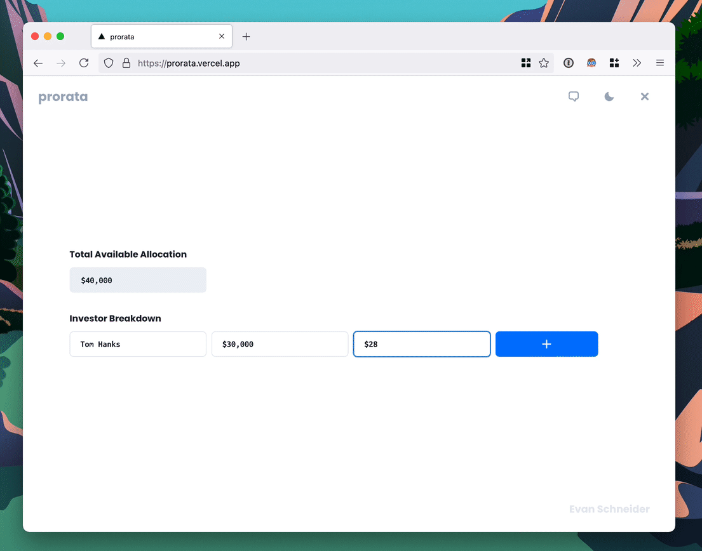
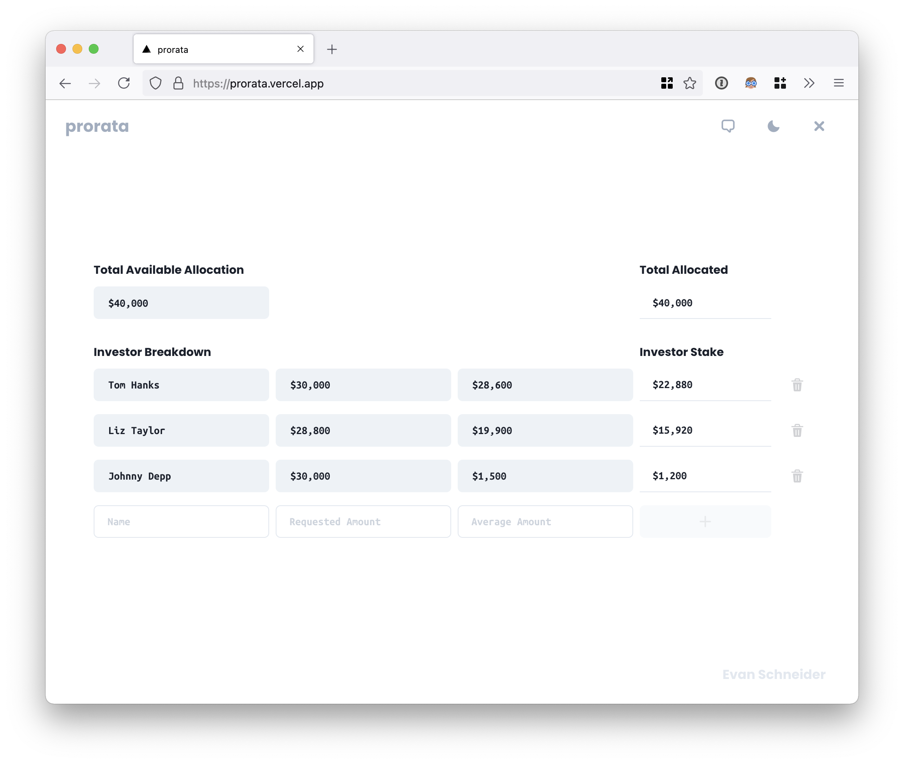
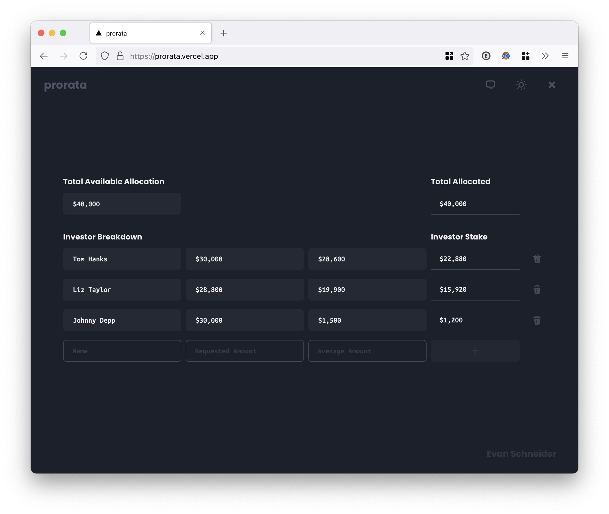
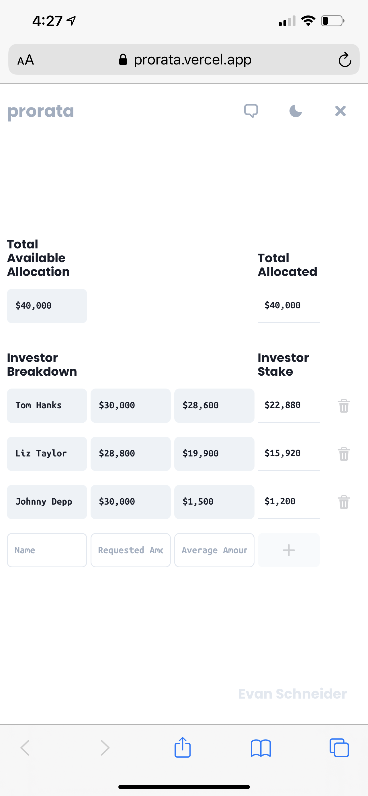
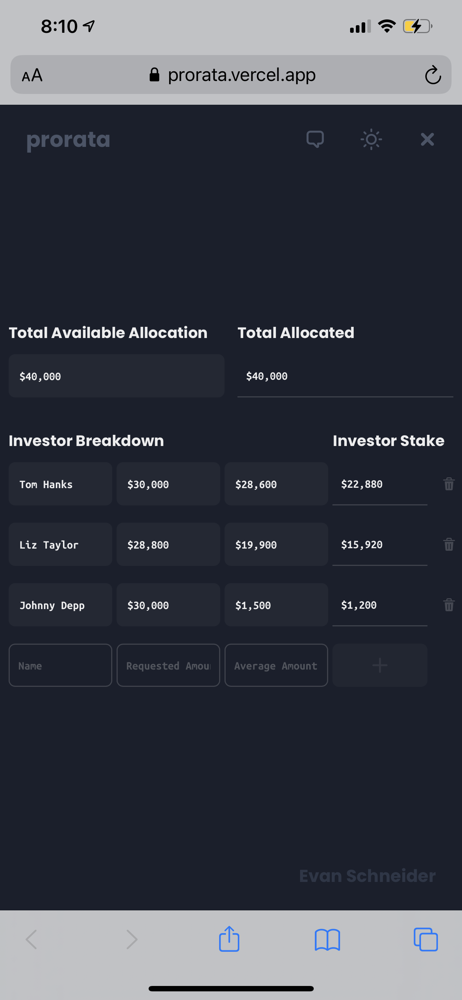

# *YATHP by Evan Schneider* 👨‍💻
Pronounced *waɪ-eɪ-tiː-eɪʧ-piː*, or Yet Another Take Home Project if you've got the syllabels to spare — this is exactly that. However on this fortutious occasion you're looking at *your* take home project, the **AngelList Venture Take Home Project**  which is definitely not a templated value for **{{IMPORTANT_PERSONS_NAME}}**

## … *on with the show*
Start playing with a deployed instance of `prorata` now — head over to [`prorata.vercel.app`](https://prorata.vercel.app) or gawk at the unnecessarily large gif.


[](https://prorata.vercel.app)

<br/>

## For later, or never, it's your choice

  To run your very own instance without too much hassle you'll just need `docker`. If you already have `docker` you're free to use the included `start` script which will execute the following commands from `./website/prorata`

```sh
docker build . -t evanrs-prorata
docker run -p 3000:3000 evanrs-prorata
```

<br/>

## And now, some pretty pictures

<div style="display: flex; justify-content: space-between">
  
  
</div>
<div style="display: flex; justify-content: space-around">
  
  
</div>


<br/>

## License

This project is [MIT licensed](./LICENSE).
