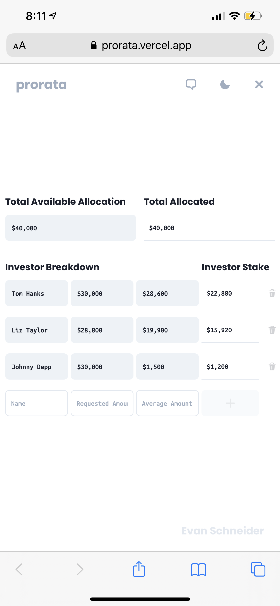

Start playing with a deployed instance of `prorata` now — head over to [`prorata.vercel.app`](https://prorata.vercel.app) or gawk at the unnecessarily large gif.

[](https://prorata.vercel.app)

<br/>

## For later, or never, it's your choice

To run your very own instance without too much hassle you'll just need `docker`. If you already have `docker` you're free to use the included `start` script which will execute the following commands from `./website/prorata`

```sh
docker build . -t evanrs-prorata
docker run -p 3000:3000 evanrs-prorata
```

Navigate to the root of this project and run `start`, like so

```sh
./start
```

And look at that, it's starting!

<br/>

## And now, some pretty pictures

<div>
  
  
  
  
</div>

The same thing, *but on a tiny computer*

<div>
  
  
  
  
</div>

<br/>

Thank you for coming to my ted talk.


<br/>

## License

This project is [BSD 3 Clause](./LICENSE).
